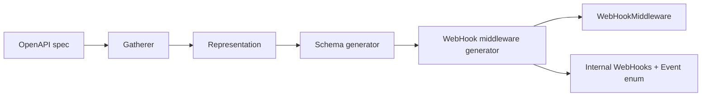

generator-psr-15-webhook-middleware
===================================

[`FileGenerator`](https://github.com/php-openapi-tools/contract) for [OpenAPI Tools](https://github.com/php-openapi-tools) that emits a PSR-15 webhook middleware stack: an enum-backed resolver, custom hydrator, and public middleware. When `entryPoints.webHookMiddleware` is enabled, it replaces the public `WebHooks` entry point and EventSauce webhook hydrators for that mode.


[](https://packagist.org/packages/openapi-tools/generator-psr-15-webhook-middleware)
[](https://packagist.org/packages/openapi-tools/generator-psr-15-webhook-middleware/stats)
[](https://packagist.org/packages/openapi-tools/generator-psr-15-webhook-middleware)

Installation
------------

```
composer require openapi-tools/generator-psr-15-webhook-middleware
```

Where it fits
-------------

This package runs after [`gatherer`](https://github.com/php-openapi-tools/gatherer) has built a [`representation`](https://github.com/php-openapi-tools/representation) and [`generator-schema`](https://github.com/php-openapi-tools/generator-schema) has emitted payload schema classes. Register `WebHookMiddleware` when middleware mode is enabled; set `includeWebHookHydrators: false` on [`generator-hydrator`](https://github.com/php-openapi-tools/generator-hydrator) so webhook hydration is owned here instead.



Example
-------

The snippet below is generated by running the webhook middleware generator against a real OpenAPI input when you run `make generate-readme`. The example driver lives in [`etc/docs/README.php`](etc/docs/README.php).

**Input** — OpenAPI webhooks (`example-input.yaml`):
```yaml
openapi: "3.1.0"
info:
  version: 1.0.0
  title: Swagger Petstore
  license:
    name: MIT
servers:
  - url: http://api.example.com/v1/
webhooks:
  healthCheck:
    post:
      summary: Health check webhook
      description: A health check event sent to verify a webhook configuration.
      operationId: health-check/received
      parameters:
        - name: X-Petstore-Event
          in: header
          example: healthCheck
          schema:
            type: string
            enum: [healthCheck]
      requestBody:
        required: true
        content:
          application/json:
            schema:
              $ref: "#/components/schemas/healthCheck"
      responses:
        "200":
          description: Return a 200 status to indicate that the data was received successfully
  inventoryUpdate:
    post:
      summary: Inventory update webhook
      description: An inventory update event sent when stock levels change.
      operationId: inventory/update
      parameters:
        - name: X-Petstore-Event
          in: header
          example: inventoryUpdate
          schema:
            type: string
            enum: [inventoryUpdate]
      requestBody:
        required: true
        content:
          application/json:
            schema:
              $ref: "#/components/schemas/inventoryUpdate"
      responses:
        "200":
          description: Return a 200 status to indicate that the data was received successfully
  storeHoursDisabled:
    post:
      summary: Store hours disabled webhook
      description: |
        Emitted when automatic store-hour enforcement is turned off.
        Shares the `action` body field with other events; `disabled` is a globally unique enum value.
      operationId: store-hours/disabled
      parameters:
        - name: X-Petstore-Event
          in: header
          example: storeHours
          schema:
            type: string
      requestBody:
        required: true
        content:
          application/json:
            schema:
              $ref: "#/components/schemas/webhook-store-hours-disabled"
      responses:
        "200":
          description: Return a 200 status to indicate that the data was received successfully
  storeHoursEnabled:
    post:
      summary: Store hours enabled webhook
      description: |
        Emitted when automatic store-hour enforcement is turned on.
        Resolved in the same partial `action` match group as `storeHoursDisabled`.
      operationId: store-hours/enabled
      parameters:
        - name: X-Petstore-Event
          in: header
          example: storeHours
          schema:
            type: string
      requestBody:
        required: true
        content:
          application/json:
            schema:
              $ref: "#/components/schemas/webhook-store-hours-enabled"
      responses:
        "200":
          description: Return a 200 status to indicate that the data was received successfully
  petCommentCreated:
    post:
      summary: Pet comment created webhook
      description: |
        One of several events whose required `action` enum is `created`.
        After unique `action` values are handled, this variant is resolved by its required fields.
      operationId: pet-comment/created
      parameters:
        - name: X-Petstore-Event
          in: header
          example: petComment
          schema:
            type: string
      requestBody:
        required: true
        content:
          application/json:
            schema:
              $ref: "#/components/schemas/webhook-pet-comment-created"
      responses:
        "200":
          description: Return a 200 status to indicate that the data was received successfully
  catalogDefinitionCreated:
    post:
      summary: Catalog definition created webhook
      description: |
        Also uses `action: created`, but requires `definition` instead of `comment`.
        Shows how colliding enum values fall through to required-field partitioning.
      operationId: catalog-definition/created
      parameters:
        - name: X-Petstore-Event
          in: header
          example: catalogDefinition
          schema:
            type: string
      requestBody:
        required: true
        content:
          application/json:
            schema:
              $ref: "#/components/schemas/webhook-catalog-definition-created"
      responses:
        "200":
          description: Return a 200 status to indicate that the data was received successfully
  orderCreated:
    post:
      summary: Order created webhook
      description: |
        Another `action: created` event. When several variants share the same top-level enum value,
        a required nested enum (`metadata.kind`) provides the next discrimination step.
      operationId: order/created
      parameters:
        - name: X-Petstore-Event
          in: header
          example: order
          schema:
            type: string
      requestBody:
        required: true
        content:
          application/json:
            schema:
              $ref: "#/components/schemas/webhook-order-created"
      responses:
        "200":
          description: Return a 200 status to indicate that the data was received successfully
  appointmentCreated:
    post:
      summary: Appointment created webhook
      description: |
        Also uses `action: created` with required `metadata`, but the nested `kind` enum is `appointment`
        instead of `order`.
      operationId: appointment/created
      parameters:
        - name: X-Petstore-Event
          in: header
          example: appointment
          schema:
            type: string
      requestBody:
        required: true
        content:
          application/json:
            schema:
              $ref: "#/components/schemas/webhook-appointment-created"
      responses:
        "200":
          description: Return a 200 status to indicate that the data was received successfully
  petLifecycle:
    post:
      summary: Pet lifecycle webhook
      description: A pet lifecycle event resolved by an `eventType` discriminator in the payload.
      operationId: pet-lifecycle/received
      requestBody:
        required: true
        content:
          application/json:
            schema:
              oneOf:
                - $ref: "#/components/schemas/adoptedPet"
                - $ref: "#/components/schemas/surrenderedPet"
              discriminator:
                propertyName: eventType
                mapping:
                  adopted: "#/components/schemas/adoptedPet"
                  surrendered: "#/components/schemas/surrenderedPet"
      responses:
        "200":
          description: Return a 200 status to indicate that the data was received successfully
  storePolicy:
    post:
      summary: Store policy webhook
      description: A store policy event resolved by an `action` discriminator in the payload.
      operationId: store-policy/received
      requestBody:
        required: true
        content:
          application/json:
            schema:
              oneOf:
                - $ref: "#/components/schemas/webhook-store-policy-created"
                - $ref: "#/components/schemas/webhook-store-policy-deleted"
              discriminator:
                propertyName: action
                mapping:
                  created: "#/components/schemas/webhook-store-policy-created"
                  deleted: "#/components/schemas/webhook-store-policy-deleted"
      responses:
        "200":
          description: Return a 200 status to indicate that the data was received successfully
components:
  schemas:
    healthCheck:
      type: object
      required:
        - eventType
        - message
      properties:
        eventType:
          type: string
          enum: [healthCheck]
        message:
          type: string
    inventoryUpdate:
      type: object
      required:
        - sku
        - quantity
      properties:
        sku:
          type: string
        quantity:
          type: integer
    webhook-store-hours-disabled:
      title: store hours disabled event
      type: object
      required:
        - action
        - store
        - sender
      properties:
        action:
          type: string
          enum: [disabled]
        store:
          $ref: "#/components/schemas/store-webhooks"
        sender:
          $ref: "#/components/schemas/customer"
    webhook-store-hours-enabled:
      title: store hours enabled event
      type: object
      required:
        - action
        - store
        - sender
      properties:
        action:
          type: string
          enum: [enabled]
        store:
          $ref: "#/components/schemas/store-webhooks"
        sender:
          $ref: "#/components/schemas/customer"
    webhook-pet-comment-created:
      title: pet comment created event
      type: object
      required:
        - action
        - comment
        - pet
        - sender
      properties:
        action:
          type: string
          enum: [created]
        comment:
          $ref: "#/components/schemas/pet-comment"
        pet:
          $ref: "#/components/schemas/pet-summary"
        sender:
          $ref: "#/components/schemas/customer"
    webhook-catalog-definition-created:
      title: catalog definition created event
      type: object
      required:
        - action
        - definition
      properties:
        action:
          type: string
          enum: [created]
        definition:
          $ref: "#/components/schemas/catalog-definition"
    webhook-order-created:
      title: order created event
      type: object
      required:
        - action
        - metadata
        - store
      properties:
        action:
          type: string
          enum: [created]
        metadata:
          $ref: "#/components/schemas/webhook-metadata-order"
        store:
          $ref: "#/components/schemas/store-webhooks"
    webhook-appointment-created:
      title: appointment created event
      type: object
      required:
        - action
        - metadata
        - store
      properties:
        action:
          type: string
          enum: [created]
        metadata:
          $ref: "#/components/schemas/webhook-metadata-appointment"
        store:
          $ref: "#/components/schemas/store-webhooks"
    webhook-metadata-order:
      type: object
      required:
        - kind
        - reference
      properties:
        kind:
          type: string
          enum: [order]
        reference:
          type: string
    webhook-metadata-appointment:
      type: object
      required:
        - kind
        - reference
      properties:
        kind:
          type: string
          enum: [appointment]
        reference:
          type: string
    pet-comment:
      type: object
      required:
        - id
        - body
      properties:
        id:
          type: integer
        body:
          type: string
    pet-summary:
      type: object
      required:
        - name
      properties:
        name:
          type: string
    catalog-definition:
      type: object
      required:
        - id
        - name
      properties:
        id:
          type: integer
        name:
          type: string
    adoptedPet:
      type: object
      required:
        - eventType
        - name
      properties:
        eventType:
          type: string
          enum: [adopted]
        name:
          type: string
    surrenderedPet:
      type: object
      required:
        - eventType
        - name
      properties:
        eventType:
          type: string
          enum: [surrendered]
        name:
          type: string
    webhook-store-policy-created:
      title: store policy created event
      type: object
      required:
        - action
        - policy
        - store
      properties:
        action:
          type: string
          enum: [created]
        franchise:
          $ref: "#/components/schemas/franchise-webhooks"
        registration:
          $ref: "#/components/schemas/store-registration"
        chain:
          $ref: "#/components/schemas/chain-webhooks"
        store:
          $ref: "#/components/schemas/store-webhooks"
        policy:
          $ref: "#/components/schemas/policy_rule"
        customer:
          $ref: "#/components/schemas/customer"
    webhook-store-policy-deleted:
      title: store policy deleted event
      type: object
      required:
        - action
        - policy
        - store
      properties:
        action:
          type: string
          enum: [deleted]
        franchise:
          $ref: "#/components/schemas/franchise-webhooks"
        registration:
          $ref: "#/components/schemas/store-registration"
        chain:
          $ref: "#/components/schemas/chain-webhooks"
        store:
          $ref: "#/components/schemas/store-webhooks"
        policy:
          $ref: "#/components/schemas/policy_rule"
        customer:
          $ref: "#/components/schemas/customer"
    franchise-webhooks:
      type: object
      properties:
        slug:
          type: string
    store-registration:
      type: object
      properties:
        id:
          type: integer
    chain-webhooks:
      type: object
      properties:
        name:
          type: string
    store-webhooks:
      type: object
      required:
        - name
      properties:
        name:
          type: string
    policy_rule:
      type: object
      required:
        - id
      properties:
        id:
          type: integer
    customer:
      type: object
      required:
        - name
      properties:
        name:
          type: string

```
Output
------

Running gatherer + `WebHookMiddleware::generate()` against the input above emits these files. Header-resolved webhooks are grouped in nested `if` blocks that first narrow by declared header parameters (presence, then spec-constrained values), then by body enums and required fields. Discriminated webhooks (`petLifecycle`, `storePolicy`) are resolved first via `detectDiscriminatedEvent()`. All resolution lives in `Internal\WebHook\WebHooks`:
src/Internal/WebHook/Hydrator.php
---------------------------------

```php
<?php declare (strict_types=1);
namespace ApiClients\Client\Example\Internal\WebHook;

final class Hydrator
{
    public function hydrate(string $className, array $data): object
    {
        return match ($className) {
            \ApiClients\Client\Example\Schema\HealthCheck::class => $this->hydrateSchemaHealthCheck($data),
            \ApiClients\Client\Example\Schema\InventoryUpdate::class => $this->hydrateSchemaInventoryUpdate($data),
            \ApiClients\Client\Example\Schema\WebhookStoreHoursDisabled::class => $this->hydrateSchemaWebhookStoreHoursDisabled($data),
            \ApiClients\Client\Example\Schema\WebhookStoreHoursEnabled::class => $this->hydrateSchemaWebhookStoreHoursEnabled($data),
            \ApiClients\Client\Example\Schema\WebhookPetCommentCreated::class => $this->hydrateSchemaWebhookPetCommentCreated($data),
            \ApiClients\Client\Example\Schema\WebhookCatalogDefinitionCreated::class => $this->hydrateSchemaWebhookCatalogDefinitionCreated($data),
            \ApiClients\Client\Example\Schema\WebhookOrderCreated::class => $this->hydrateSchemaWebhookOrderCreated($data),
            \ApiClients\Client\Example\Schema\WebhookAppointmentCreated::class => $this->hydrateSchemaWebhookAppointmentCreated($data),
            \ApiClients\Client\Example\Schema\AdoptedPet::class => $this->hydrateSchemaAdoptedPet($data),
            \ApiClients\Client\Example\Schema\SurrenderedPet::class => $this->hydrateSchemaSurrenderedPet($data),
            \ApiClients\Client\Example\Schema\WebhookStorePolicyCreated::class => $this->hydrateSchemaWebhookStorePolicyCreated($data),
            \ApiClients\Client\Example\Schema\WebhookStorePolicyDeleted::class => $this->hydrateSchemaWebhookStorePolicyDeleted($data),
            default => throw new \RuntimeException('Unknown webhook payload class'),
        };
    }
    private function hydrateSchemaHealthCheck(array $data): \ApiClients\Client\Example\Schema\HealthCheck
    {
        return new \ApiClients\Client\Example\Schema\HealthCheck(eventType: $data['eventType'], message: $data['message']);
    }
    private function hydrateSchemaInventoryUpdate(array $data): \ApiClients\Client\Example\Schema\InventoryUpdate
    {
        return new \ApiClients\Client\Example\Schema\InventoryUpdate(sku: $data['sku'], quantity: $data['quantity']);
    }
    private function hydrateSchemaWebhookStoreHoursDisabled(array $data): \ApiClients\Client\Example\Schema\WebhookStoreHoursDisabled
    {
        return new \ApiClients\Client\Example\Schema\WebhookStoreHoursDisabled(action: $data['action'], store: $this->hydrate(\ApiClients\Client\Example\Schema\StoreWebhooks::class, $data['store']), sender: $this->hydrate(\ApiClients\Client\Example\Schema\Customer::class, $data['sender']));
    }
    private function hydrateSchemaWebhookStoreHoursEnabled(array $data): \ApiClients\Client\Example\Schema\WebhookStoreHoursEnabled
    {
        return new \ApiClients\Client\Example\Schema\WebhookStoreHoursEnabled(action: $data['action'], store: $this->hydrate(\ApiClients\Client\Example\Schema\StoreWebhooks::class, $data['store']), sender: $this->hydrate(\ApiClients\Client\Example\Schema\Customer::class, $data['sender']));
    }
    private function hydrateSchemaWebhookPetCommentCreated(array $data): \ApiClients\Client\Example\Schema\WebhookPetCommentCreated
    {
        return new \ApiClients\Client\Example\Schema\WebhookPetCommentCreated(action: $data['action'], comment: $this->hydrate(\ApiClients\Client\Example\Schema\PetComment::class, $data['comment']), pet: $this->hydrate(\ApiClients\Client\Example\Schema\PetSummary::class, $data['pet']), sender: $this->hydrate(\ApiClients\Client\Example\Schema\Customer::class, $data['sender']));
    }
    private function hydrateSchemaWebhookCatalogDefinitionCreated(array $data): \ApiClients\Client\Example\Schema\WebhookCatalogDefinitionCreated
    {
        return new \ApiClients\Client\Example\Schema\WebhookCatalogDefinitionCreated(action: $data['action'], definition: $this->hydrate(\ApiClients\Client\Example\Schema\CatalogDefinition::class, $data['definition']));
    }
    private function hydrateSchemaWebhookOrderCreated(array $data): \ApiClients\Client\Example\Schema\WebhookOrderCreated
    {
        return new \ApiClients\Client\Example\Schema\WebhookOrderCreated(action: $data['action'], metadata: $this->hydrate(\ApiClients\Client\Example\Schema\WebhookMetadataOrder::class, $data['metadata']), store: $this->hydrate(\ApiClients\Client\Example\Schema\StoreWebhooks::class, $data['store']));
    }
    private function hydrateSchemaWebhookAppointmentCreated(array $data): \ApiClients\Client\Example\Schema\WebhookAppointmentCreated
    {
        return new \ApiClients\Client\Example\Schema\WebhookAppointmentCreated(action: $data['action'], metadata: $this->hydrate(\ApiClients\Client\Example\Schema\WebhookMetadataAppointment::class, $data['metadata']), store: $this->hydrate(\ApiClients\Client\Example\Schema\StoreWebhooks::class, $data['store']));
    }
    private function hydrateSchemaAdoptedPet(array $data): \ApiClients\Client\Example\Schema\AdoptedPet
    {
        return new \ApiClients\Client\Example\Schema\AdoptedPet(eventType: $data['eventType'], name: $data['name']);
    }
    private function hydrateSchemaSurrenderedPet(array $data): \ApiClients\Client\Example\Schema\SurrenderedPet
    {
        return new \ApiClients\Client\Example\Schema\SurrenderedPet(eventType: $data['eventType'], name: $data['name']);
    }
    private function hydrateSchemaWebhookStorePolicyCreated(array $data): \ApiClients\Client\Example\Schema\WebhookStorePolicyCreated
    {
        return new \ApiClients\Client\Example\Schema\WebhookStorePolicyCreated(action: $data['action'], franchise: $data['franchise'] === null ? null : $this->hydrate(\ApiClients\Client\Example\Schema\FranchiseWebhooks::class, $data['franchise']), registration: $data['registration'] === null ? null : $this->hydrate(\ApiClients\Client\Example\Schema\StoreRegistration::class, $data['registration']), chain: $data['chain'] === null ? null : $this->hydrate(\ApiClients\Client\Example\Schema\ChainWebhooks::class, $data['chain']), store: $this->hydrate(\ApiClients\Client\Example\Schema\StoreWebhooks::class, $data['store']), policy: $this->hydrate(\ApiClients\Client\Example\Schema\PolicyRule::class, $data['policy']), customer: $data['customer'] === null ? null : $this->hydrate(\ApiClients\Client\Example\Schema\Customer::class, $data['customer']));
    }
    private function hydrateSchemaWebhookStorePolicyDeleted(array $data): \ApiClients\Client\Example\Schema\WebhookStorePolicyDeleted
    {
        return new \ApiClients\Client\Example\Schema\WebhookStorePolicyDeleted(action: $data['action'], franchise: $data['franchise'] === null ? null : $this->hydrate(\ApiClients\Client\Example\Schema\FranchiseWebhooks::class, $data['franchise']), registration: $data['registration'] === null ? null : $this->hydrate(\ApiClients\Client\Example\Schema\StoreRegistration::class, $data['registration']), chain: $data['chain'] === null ? null : $this->hydrate(\ApiClients\Client\Example\Schema\ChainWebhooks::class, $data['chain']), store: $this->hydrate(\ApiClients\Client\Example\Schema\StoreWebhooks::class, $data['store']), policy: $this->hydrate(\ApiClients\Client\Example\Schema\PolicyRule::class, $data['policy']), customer: $data['customer'] === null ? null : $this->hydrate(\ApiClients\Client\Example\Schema\Customer::class, $data['customer']));
    }
}
```
src/Internal/WebHook/Event.php
------------------------------

```php
<?php declare (strict_types=1);
namespace ApiClients\Client\Example\Internal\WebHook;

enum Event
{
    case HealthCheck;
    case InventoryUpdate;
    case WebhookStoreHoursDisabled;
    case WebhookStoreHoursEnabled;
    case WebhookPetCommentCreated;
    case WebhookCatalogDefinitionCreated;
    case WebhookOrderCreated;
    case WebhookAppointmentCreated;
    case AdoptedPet;
    case SurrenderedPet;
    case WebhookStorePolicyCreated;
    case WebhookStorePolicyDeleted;
}
```
src/Internal/WebHook/WebHooks.php
---------------------------------

```php
<?php declare (strict_types=1);
namespace ApiClients\Client\Example\Internal\WebHook;

final class WebHooks
{
    private static array $parsedSchemas = [];
    public function __construct(private readonly \League\OpenAPIValidation\Schema\SchemaValidator $requestSchemaValidator, private readonly \ApiClients\Client\Example\Internal\WebHook\Hydrator $hydrator)
    {
    }
    public function resolve(array $headers, array $data): object
    {
        return match ($this->detectDiscriminatedEvent($data)) {
            Event::AdoptedPet => $this->validatedHydrate(\ApiClients\Client\Example\Schema\AdoptedPet::class, $data),
            Event::SurrenderedPet => $this->validatedHydrate(\ApiClients\Client\Example\Schema\SurrenderedPet::class, $data),
            Event::WebhookStorePolicyCreated => $this->validatedHydrate(\ApiClients\Client\Example\Schema\WebhookStorePolicyCreated::class, $data),
            Event::WebhookStorePolicyDeleted => $this->validatedHydrate(\ApiClients\Client\Example\Schema\WebhookStorePolicyDeleted::class, $data),
            default => $this->resolveByHeaders($headers, $data),
        };
    }
    private function detectDiscriminatedEvent(array $data): ?Event
    {
        if (array_key_exists('eventType', $data)) {
            $event = match ($data['eventType']) {
                'adopted' => Event::AdoptedPet,
                'surrendered' => Event::SurrenderedPet,
                default => null,
            };
            if ($event instanceof Event) {
                return $event;
            }
        }
        if (array_key_exists('action', $data)) {
            $event = match ($data['action']) {
                'created' => Event::WebhookStorePolicyCreated,
                'deleted' => Event::WebhookStorePolicyDeleted,
                default => null,
            };
            if ($event instanceof Event) {
                return $event;
            }
        }
        return null;
    }
    private function resolveByHeaders(array $headers, array $data): object
    {
        $error = new \RuntimeException('No webhook matching given headers and data');
        try {
            if (array_key_exists('x-petstore-event', $headers)) {
                $resolvedPayload = match ($headers['x-petstore-event']) {
                    'healthCheck' => $this->validatedHydrate(\ApiClients\Client\Example\Schema\HealthCheck::class, $data),
                    'inventoryUpdate' => $this->validatedHydrate(\ApiClients\Client\Example\Schema\InventoryUpdate::class, $data),
                    default => null,
                };
                if (!($resolvedPayload === null)) {
                    return $resolvedPayload;
                }
                if (array_key_exists('action', $data)) {
                    $resolvedPayload = match ($data['action']) {
                        'disabled' => $this->validatedHydrate(\ApiClients\Client\Example\Schema\WebhookStoreHoursDisabled::class, $data),
                        'enabled' => $this->validatedHydrate(\ApiClients\Client\Example\Schema\WebhookStoreHoursEnabled::class, $data),
                        default => null,
                    };
                    if (!($resolvedPayload === null)) {
                        return $resolvedPayload;
                    }
                    if ($data['action'] === 'created') {
                        if (array_key_exists('metadata', $data) && array_key_exists('kind', $data['metadata'])) {
                            $resolvedPayload = match ($data['metadata']['kind']) {
                                'order' => $this->validatedHydrate(\ApiClients\Client\Example\Schema\WebhookOrderCreated::class, $data),
                                'appointment' => $this->validatedHydrate(\ApiClients\Client\Example\Schema\WebhookAppointmentCreated::class, $data),
                                default => null,
                            };
                            if (!($resolvedPayload === null)) {
                                return $resolvedPayload;
                            }
                        }
                        if (array_key_exists('comment', $data) && array_key_exists('pet', $data) && array_key_exists('sender', $data)) {
                            return $this->validatedHydrate(\ApiClients\Client\Example\Schema\WebhookPetCommentCreated::class, $data);
                        }
                        if (array_key_exists('definition', $data)) {
                            return $this->validatedHydrate(\ApiClients\Client\Example\Schema\WebhookCatalogDefinitionCreated::class, $data);
                        }
                    }
                }
            }
        } catch (\Throwable $throwable) {
            $error = $throwable;
        }
        throw $error;
    }
    private function validatedHydrate(string $className, array $data): object
    {
        if (!array_key_exists($className, self::$parsedSchemas)) {
            self::$parsedSchemas[$className] = \cebe\openapi\Reader::readFromJson($className::SCHEMA_JSON, \cebe\openapi\spec\Schema::class);
        }
        $this->requestSchemaValidator->validate($data, self::$parsedSchemas[$className]);
        return $this->hydrator->hydrate(className::class, $data);
    }
}
```
src/WebHookMiddleware.php
-------------------------

```php
<?php declare (strict_types=1);
namespace ApiClients\Client\Example;

use OpenAPITools\Contract\WebHookHandlerInterface;
use \ApiClients\Client\Example\Internal\WebHook\InvalidWebHookRequestException;
use \ApiClients\Client\Example\Internal\WebHook\WebHooks;
use Psr\Http\Message\ResponseInterface;
use Psr\Http\Message\ServerRequestInterface;
use Psr\Http\Server\MiddlewareInterface;
use Psr\Http\Server\RequestHandlerInterface;
final readonly class WebHookMiddleware implements Psr\Http\Server\MiddlewareInterface
{
    public function __construct(private readonly \ApiClients\Client\Example\Internal\WebHook\WebHooks $webHooks, private readonly \OpenAPITools\Contract\WebHookHandlerInterface $handler, private readonly array $paths = ['/webhook'])
    {
    }
    public function process(ServerRequestInterface $request, RequestHandlerInterface $handler): ResponseInterface
    {
        if ($this->paths !== [] && !in_array($request->getUri()->getPath(), $this->paths, true)) {
            return $handler->handle($request);
        }
        $body = (string) $request->getBody();
        if ($body === '') {
            throw new InvalidWebHookRequestException('Missing webhook request body');
        }
        $data = json_decode($body, true);
        if (is_array($data) !== true) {
            throw new InvalidWebHookRequestException('Invalid webhook request body');
        }
        $headers = [];
        foreach ($request->getHeaders() as $name => $values) {
            $headers[strtolower($name)] = $values[0];
        }
        try {
            $payload = $this->webHooks->resolve($headers, $data);
        } catch (\Throwable $throwable) {
            throw new InvalidWebHookRequestException('Failed to resolve webhook', 0, $throwable);
        }
        return $this->handler->handle($payload);
    }
}
```
For each payload variant in the spec, the generator emits:

| Class | Visibility |
| --- | --- |
| `WebHookMiddleware` | Public |
| `Internal\WebHook\WebHooks` | Internal — enum `match` for discriminators, header matching fallback otherwise |
| `Internal\WebHook\Event` | Internal — one enum case per payload variant |
| `Internal\WebHook\Hydrator` | Internal |
| `Internal\WebHook\InvalidWebHookRequestException` | Internal |

Schema classes (`Schema\Ping`, `Schema\Push`, …) are still emitted by [`generator-schema`](https://github.com/php-openapi-tools/generator-schema).

### Resolution order

For each webhook delivery, generated code resolves the payload in this order:

1. **Discriminator** — when the spec defines `discriminator`, match `$data[$propertyName]` via `detectDiscriminatedEvent()`
2. **Headers** — match declared webhook header parameters (e.g. `X-Petstore-Event`) and hoist shared presence checks
3. **Body enums** — partial `match` on required single-value enums (top-level and nested); colliding values recurse to deeper enums or required fields
4. **Field fingerprint** — remaining variants require their spec-mandated fields in `$data`
5. **Validation** — `SchemaValidator` against generated `SCHEMA_JSON`
6. **Hydration** — `Internal\WebHook\Hydrator` maps arrays to readonly schema objects (no EventSauce)

### Behaviour

- **Path filter:** when `$paths` is non-empty, only matching request paths are treated as webhooks; all other requests pass through unchanged.
- **Empty paths:** when `$paths` is `[]`, every request is treated as a potential webhook (intended for local development and testing).
- **Strict:** invalid JSON, missing body, or failed resolve throws `InvalidWebHookRequestException`.
- **Happy path:** on success, returns `$this->handler->handle($payload)` directly.

### Usage in `openapi-client-generator`

```yaml
entryPoints:
  webHookMiddleware: true
```

Or with explicit paths (overridable at runtime via the middleware constructor):

```yaml
entryPoints:
  webHookMiddleware:
    paths:
      - /webhook
      - /hooks/github
```

When middleware mode is enabled, `webHooks: true` is implied but the public `WebHooks` / `WebHook` generators are not registered.

Implement `OpenAPITools\Contract\WebHookHandlerInterface` to handle resolved payloads:

```php
final readonly class MyWebHookHandler implements WebHookHandlerInterface
{
    public function handle(object $payload): ResponseInterface
    {
        return match ($payload::class) {
            Ping::class => $this->ping($payload),
            default => new EmptyResponse(404),
        };
    }
}
```

Wire the middleware in your HTTP application:

```php
$middleware = new WebHookMiddleware(
    new Internal\WebHook\WebHooks($requestSchemaValidator, new Internal\WebHook\Hydrator()),
    new MyWebHookHandler(),
    paths: ['/webhook'],
);
```

In a full client package, `WebHookMiddleware` is wired into the generator run loop alongside other `FileGenerator` implementations. A minimal direct invocation looks like this:

```php
use OpenAPITools\Generator\PSR15\WebHook\WebHookMiddleware;
use PhpParser\BuilderFactory;

$generator = new WebHookMiddleware(new BuilderFactory(), defaultPaths: ['/webhook']);

foreach ($generator->generate($package, $representation->namespace($package->namespace)) as $file) {
    // $file->pathPrefix  — e.g. "src"
    // $file->fqcn        — e.g. "WebHookMiddleware"
    // $file->contents    — PhpParser Node
}
```

See [`openapi-tools/generator`](https://github.com/php-openapi-tools/generator#configuration) for a complete package configuration.

Related packages
----------------

| Package | Relationship |
| --- | --- |
| [`contract`](https://github.com/php-openapi-tools/contract) | `FileGenerator`, `WebHookHandlerInterface`, and `Package` interfaces |
| [`representation`](https://github.com/php-openapi-tools/representation) | Input model consumed by this generator |
| [`gatherer`](https://github.com/php-openapi-tools/gatherer) | Builds the representation from OpenAPI |
| [`generator-schema`](https://github.com/php-openapi-tools/generator-schema) | Emits payload schema classes this generator hydrates |
| [`generator-hydrator`](https://github.com/php-openapi-tools/generator-hydrator) | Disable webhook hydrators when this package is active |
| [`generator-utils`](https://github.com/php-openapi-tools/generator-utils) | AST builders used by this generator |
| [`generator`](https://github.com/php-openapi-tools/generator) | CLI and run loop that orchestrates all generators |

Contributing
------------

Please see [CONTRIBUTING](CONTRIBUTING.md) for details.

License
-------

The MIT License (MIT)

Copyright (c) 2026 Cees-Jan Kiewiet

Permission is hereby granted, free of charge, to any person obtaining a copy
of this software and associated documentation files (the "Software"), to deal
in the Software without restriction, including without limitation the rights
to use, copy, modify, merge, publish, distribute, sublicense, and/or sell
copies of the Software, and to permit persons to whom the Software is
furnished to do so, subject to the following conditions:

The above copyright notice and this permission notice shall be included in all
copies or substantial portions of the Software.

THE SOFTWARE IS PROVIDED "AS IS", WITHOUT WARRANTY OF ANY KIND, EXPRESS OR
IMPLIED, INCLUDING BUT NOT LIMITED TO THE WARRANTIES OF MERCHANTABILITY,
FITNESS FOR A PARTICULAR PURPOSE AND NONINFRINGEMENT. IN NO EVENT SHALL THE
AUTHORS OR COPYRIGHT HOLDERS BE LIABLE FOR ANY CLAIM, DAMAGES OR OTHER
LIABILITY, WHETHER IN AN ACTION OF CONTRACT, TORT OR OTHERWISE, ARISING FROM,
OUT OF OR IN CONNECTION WITH THE SOFTWARE OR THE USE OR OTHER DEALINGS IN THE
SOFTWARE.

